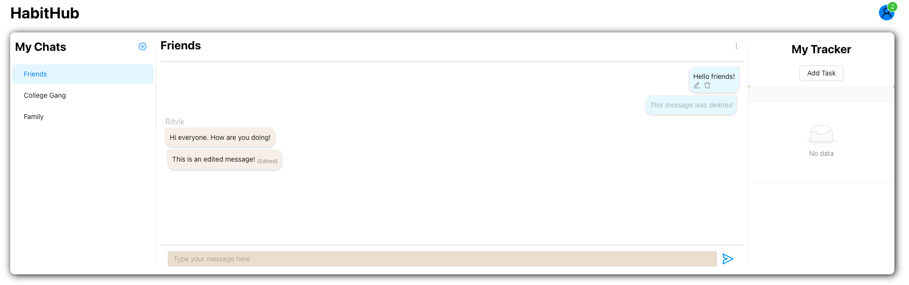
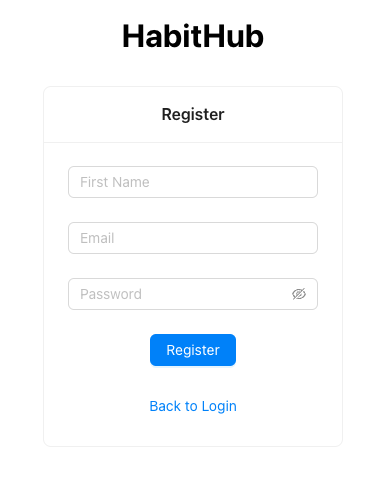

# Group-Habit-Tracker

A Simple chat interface for chatting on a group as well as managing your habits. Each time a habit/ task is completed, a message goes out on the group chat to your friends stating that you completed your task. Kudos!

## Currently a Chat Application
The tool currently serves as a chat application, with the following capabilities - 
1. Registration/ Login - Users can create an account on the platform to engage with others. The session is managed using cookies and all apis are authenticated.
2. Create groups - A user can create groups involving other registered members. There is the concept of admin and members where the admin can add/ remove members.
3. Chat in groups - Admins/ members can interact with each other on the groups. Using sockets and chatrooms, the messages are propagated in real time.
4. Edit message - A member can edit his previously sent messages at any time, and it updates for all the other members. A subscript is presented that says "Edited" for all such messages.
5. Delete messages - Members of a group can also delete their messages in case of any mistake. It shows as "This message was deleted" on the group. The message, however, is retained in the backend, but not accessible to the end user.

## Screenshots

